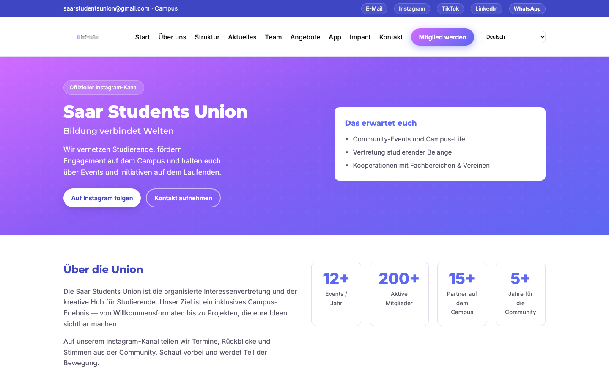

# Saar Students Union – Website

Offizielle Website der Saar Students Union e.&nbsp;V. – dreisprachig (Deutsch, Englisch, Arabisch),
ohne Framework und ohne Build-Schritt.

**Live:** [saarstudentunion.de](https://saarstudentunion.de)



## Funktionen

- **Mehrsprachigkeit** Deutsch / Englisch / Arabisch inkl. Rechts-nach-links-Layout, umschaltbar ohne Neuladen
- **Datengetriebene Inhalte:** Vorstand und Team werden aus `data/team.json` gerendert
- **Abschnitte** für Verein, Struktur, Aktuelles, Team, Angebote, App-Vorstellung und Impact
- **Responsives Design** für Smartphone, Tablet und Desktop
- **SEO:** `sitemap.xml`, `robots.txt`, Meta- und Open-Graph-Tags
- Optionale Anbindung an Supabase (Vorlage: `data/config.example.json`)

## Tech-Stack

HTML5 · CSS3 · Vanilla JavaScript · nginx

## Projektstruktur

```text
├── index.html        Hauptseite
├── css/style.css     Styles
├── js/               i18n, Team- und Feed-Rendering
├── data/             team.json, config.example.json
├── images/           Logo, Team-Fotos, App-Grafiken
└── robots.txt, sitemap.xml
```

## Lokal starten

```bash
python3 -m http.server 8000
# http://localhost:8000
```

Ein lokaler Server ist nötig, weil `data/team.json` per `fetch` geladen wird.

## Deployment

Ausgeliefert über nginx aus `/var/www/ssu-web/home/`. Alle nicht-statischen Routen (API,
Messenger, Lernräume) leitet nginx an das Flask-Backend der SSU-App weiter.

## Offene Punkte

- Impressum und Datenschutz (§ 5 TMG): vollständige Anschrift und Vereinsregister-Nr. ergänzen
- App-Download (`/get/`, `/download/`) ist bis zur offiziellen Veröffentlichung der App gesperrt

## Autor

Mohamed Ali Aladani – Gründungsmitglied und stellv. Vorsitzender der Saar Students Union e.&nbsp;V.
